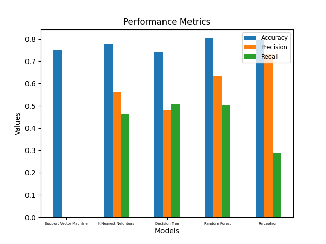
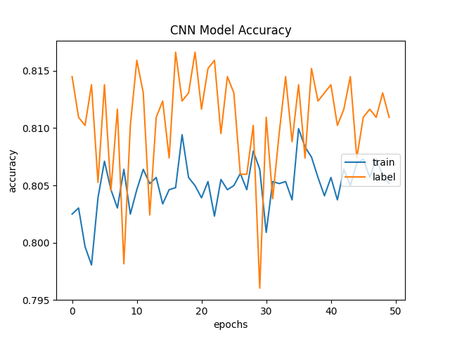
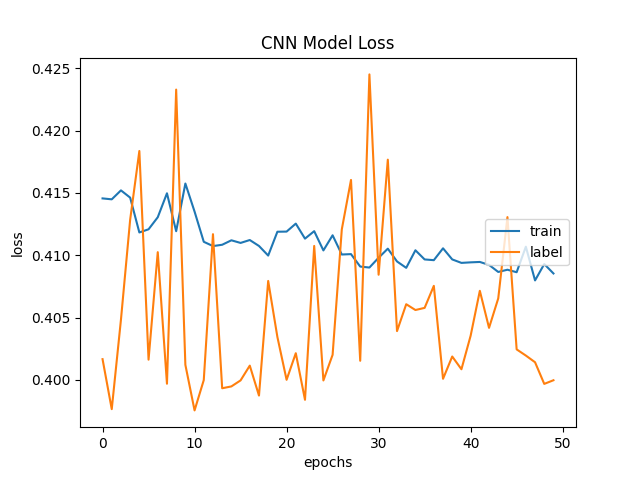

# iChurn

An Analysis of Different Classification Algorithms for Customer Churn Prediction.

## Introduction

Customer churn prediction is a very important classification problem in machine learning as it helps businesses to identify customers who are likely to cancel a subscription or service. This project aims to predict customer churn for a telecom company using a dataset from [Kaggle](https://www.kaggle.com/datasets/blastchar/telco-customer-churn).

## Data

The dataset contains 7043 rows and 21 columns. Each row represents a customer, each column contains customer’s attributes described on the column Metadata.

## Results

The following classifiers were used to predict customer churn:

1. Support Vector Machine
2. K-Nearest Neighbors
3. Decision Tree
4. Random Forest
5. Multinomial Naive Bayes
6. Multilayer Perceptron
7. Convolutional Neural Network

Classifiers 1-6 were then compared using the following performance metrics:

    

The CNN model was seperately trained, and the following plots were obtained:

| Accuracy Plot |  Loss Plot |
|:-------------------------:|:-------------------------: |
|  |  |

## Conclusion

The CNN model outperformed all other classifiers with an accuracy of 0.81 and a loss of 0.42. The Multilayer Perceptron model was the second best classifier with an accuracy of 0.80 and a loss of 0.43. The SVM model was the worst classifier with an accuracy of 0.73.
